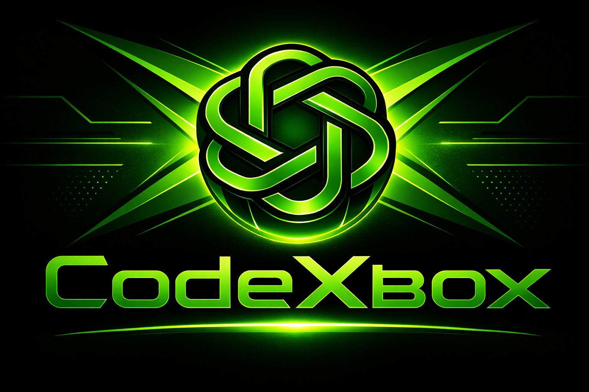

<p align="center">
  
</p>

# codexbox

**codexbox** is a Go CLI that gives you a per-project, persistent, container-backed environment for running the OpenAI Codex CLI alongside a full developer toolchain (Go, Rust, Node, Python, C/C++, .NET, bubblewrap, Docker CLI).

Each detected project gets its own long-lived container. By default, a git repo shares one container rooted at the repo top level; outside git, the current directory is the project root. When you run `codexbox`, it:

1. Mounts the detected project root into the container at `/workspace`
2. Starts (or resumes) the project container
3. Runs `codex` inside it through a small launch wrapper by default
4. Stops the container when Codex exits (but does not delete it)

The next time you run `codexbox` for the same detected project, it reuses the same container and starts a new Codex process in that persistent environment.

This gives you:

- Reproducible toolchains per project
- Persistent per-project environments
- Clean separation between projects
- No host pollution
- A consistent Fedora dev environment everywhere
- Built-in peon-ping integration for Codex sessions

---

## Features

- Fedora-based image with latest Go and .NET SDK, Rust (rustup), Node.js, Python, zsh, `bubblewrap` (`/usr/bin/bwrap`), Docker CLI (`docker`, `docker buildx`, `docker compose`), go-task, `mise`, and C/C++ toolchain
- Per-project persistent containers
- Automatic project detection from directory or git repo
- Reuse the same persistent container across runs
- Image versioning and upgrade path
- Project listing and deletion
- Destructive rebase using the configured image tag
- Persistent per-project language cache volumes (Go, Cargo, npm, pip)
- Host Docker socket passthrough for new containers when `/var/run/docker.sock` exists
- UID/GID mapping to avoid root-owned files
- Safe secret handling (env or env-file)
- Resource limit flags
- Optional per-directory or per-repo project scoping
- peon-ping installed in the image with default voice pack `peasant`
- Launch-time peon-ping notify bootstrap, optional Pushover mobile config, and startup self-check
- peon-ping runtime state staged under mounted `CODEX_HOME`, with a runtime `peon.sh` shim so relay-backed sounds keep using container-safe relative paths

---

## Requirements

- Docker or Podman
- No separate host Codex install is required; the base image installs `@openai/codex`

---

## Tasks

If you use `go-task`, common tasks are defined in `Taskfile.yml`:

```text
task fmt
task tidy
task build
task test
task vet
task check
task image-build
task image-update
task clean
```

`task image-build` and `task image-update` run `./codexbox`, so build the binary first with `task build` or `go build -o codexbox ./cmd/codexbox`.

---

## Basic Usage

Build the base image first:

```bash
codexbox image build
```

Then start Codex inside the current project:

```bash
codexbox
```

First run:

- Creates the container
- Runs `codexbox-launch`, which prepares peon-ping integration, applies optional Pushover mobile notification config, and then starts `codex`
- Warns if host `/var/run/docker.sock` is unavailable: `codexbox: warning: Unable to pass through docker socket, docker capabilities may not function`

Subsequent runs:

- Starts the container
- Runs `codexbox-launch`, which prepares peon-ping integration, applies optional Pushover mobile notification config, and then starts `codex`
- Warns if host `/var/run/docker.sock` is unavailable: `codexbox: warning: Unable to pass through docker socket, docker capabilities may not function`

When Codex exits, the container is stopped.

---

## Commands

```text
codexbox [flags]

Run or resume a Codex sandbox for the current project.

Commands:
  list               List project containers
  rm <project>       Remove a project container
  rebase [project]   Recreate project container using the configured image tag
  init               Add .codex to .gitignore
  doctor             Show container engine version information
  config             Show registry path
  status             Show status of current project container

  image build        Build base image
  image update       Update and rebuild base image
```

---

## Flags

```text
  --engine docker|podman
  --image <tag>
  --project-scope repo|dir
  --shell
  --cmd "<command>"
  --fresh
  --readonly
  --cpus <n>
  --memory <size>
  --env-file <path>
  --no-gpu
```

`--no-gpu` is currently accepted by the CLI but has no effect on container creation or execution.

---

## Managing Projects

List all project containers (includes status and last used time):

```bash
codexbox list
```

Delete a project container:

```bash
codexbox rm <project>
```

Recreate a project container using the configured image tag (defaults to the current project if omitted):

```bash
codexbox rebase [project]
```

Show status for the current project container:

```bash
codexbox status
```

---

## Managing the Base Image

Build the base image:

```bash
codexbox image build
```

Update and rebuild image:

```bash
codexbox image update
```

These commands build from the embedded image assets in `internal/image/assets/`, not from a repository-root `Dockerfile`.

The base image installs the latest Go and .NET SDK releases at build time and includes `zsh`, `bubblewrap` (`/usr/bin/bwrap`), Docker CLI tooling (`docker`, buildx, compose), and the `task` CLI.
It also installs `@openai/codex`, peon-ping, and the `codexbox-launch` wrapper used for default sessions.

`image update` pulls the latest base layers and rebuilds without using build cache.

New containers created with that tag will use the rebuilt image automatically. Existing project containers keep their current container until you recreate them with `codexbox rebase` or `codexbox --fresh`.
This also applies to socket mount updates such as Docker socket passthrough.

---

## How Project Identity Works

By default:

- If inside a git repo, project scope is the repo root
- Otherwise, project scope is the current directory

A stable hash of the path (and remote URL if available) is used as the project ID.

You can override the behavior with:

```bash
codexbox --project-scope dir
```

---

## Secrets

Codex API keys are never baked into images. They are passed via:

- `OPENAI_API_KEY`
- `OPENAI_BASE_URL` (optional)
- `PEON_MOBILE_PUSHOVER_USER_KEY` (optional)
- `PEON_MOBILE_PUSHOVER_APP_TOKEN` (optional)
- `--env-file`

If both `PEON_MOBILE_PUSHOVER_USER_KEY` and `PEON_MOBILE_PUSHOVER_APP_TOKEN` are present, `codexbox-launch` configures peon-ping mobile notifications for Pushover on session start. This applies on the default `codexbox` path; `--shell` and `--cmd` bypass the launch wrapper.
The wrapper stages peon-ping's writable runtime config under the mounted `CODEX_HOME`, and writes a runtime `peon.sh` shim so relay-backed sounds keep using relative paths that peon-ping's relay accepts. The mobile notification config therefore persists across long-lived containers without breaking relay playback.

---

## Caches

Persistent per-project container volumes are used for:

- Go modules
- Cargo registry and git
- npm cache
- pip cache

This keeps repeated installs and builds fast within the same project container.

---

## UID/GID Mapping

On Linux, containers run with your UID/GID so files in the workspace are not owned by root.

The current implementation only sets explicit UID/GID mapping on Linux.

---

## Resource Limits

Optional flags:

```bash
codexbox --cpus 4 --memory 8g
```

---

## Registry Location

- macOS: `~/Library/Application Support/codexbox/registry.json`
- Linux: `~/.local/share/codexbox/registry.json`

The registry stores project metadata such as `path`, `image_tag`, `created_at`, and `last_used`.

---

## Optional: Git Ignore

If Codex writes `.codex/` into the workspace:

```bash
codexbox init
```

Adds it to `.gitignore`.

---

## License

Licensed under the 0-Clause BSD license. See `LICENSE`.
